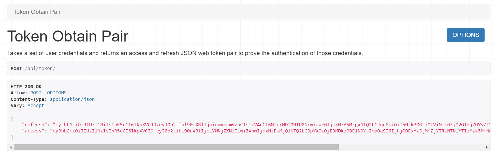
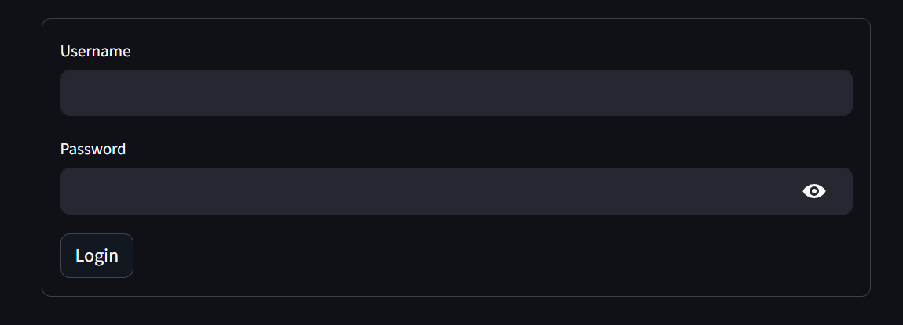

# Streamlit JWT Authenticator

An authentication module to add JWT authentication via API for Streamlit applications

## Table of Content

- [Installation](#installation)
- [Quickstart](#quickstart)
    - [Pre-requirements](#1-pre-requirements)
    - [Create Streamlit Application](#2-create-streamlit-application)
- [Configuration](#configuration)
    - [Authenticator()](#authenticator)
    - [Authenticator.login](#authenticatorlogin)
    - [Authenticator.logout](#authenticatorlogout)
- [License](#license)

## Installation

Install Streamlit JWT Authenticator with PyPI

> pip install streamlit-jwt-authenticator

## Quickstart

### 1. Pre-requirements

Streamlit JWT Authenticator allows you to use available JWT APIs.
Therefore, make sure you have a working JWT authentication API.



### 2. Create Streamlit Application

In a quick start, the previously developed API can be added to the code block below and run.

```python
import streamlit as st

from streamlit_jwt_authenticator import Authenticator

# Your API url to get JWT token 
api_url = "http://localhost/api/token/"

# Create Authenticator instance
authenticator = Authenticator(api_url)

# Add login form
authenticator.login()

# Check is user logged in successfully
if st.session_state["authentication_status"]:
    # Add logout form
    authenticator.logout()
```

This code should show you a login screen like below:



## Configuration

### Authenticator()

To use the `Authenticator` class, you need to initialize an instance with the necessary parameters:

```python
from streamlit_jwt_authenticator import Authenticator

authenticator = Authenticator(url="your_authentication_endpoint", headers={"Content-Type": "application/json"})
```

Parameters:

- `url` (str): The authentication endpoint URL.
- `method` (str, optional): The HTTP method for authentication requests. Defaults to "post".
- `headers` (dict, optional): Additional headers to include in authentication requests.
- `response_handler` (callable, optional): A function to process the authentication response.
- `token_key` (str, optional): The key to identify the authentication token in the response. Defaults to "access".
- `cookie_lifetime` (timedelta, optional): The lifetime of the authentication cookie. Defaults to timedelta(minutes=15).

### Authenticator.login

The `login` method is used to display a login form and handle user authentication. By default, it is configured to be
used within a Streamlit application.

```python
from streamlit_jwt_authenticator import Authenticator

authenticator = Authenticator(...)
authenticator.login()
```

Parameters:

- `location` (str, optional): Location to display the login form, either 'main' or 'sidebar'. Defaults to 'main'.

### Authenticator.logout

The `logout` method handles user logout by clearing authentication cookies and session state. Please
check `authentication_status` before display logout form.

```python
import streamlit as st

from streamlit_jwt_authenticator import Authenticator

authenticator = Authenticator(...)

if st.session_state["authentication_status"]:
    authenticator.logout()
```

Parameters:

- `location` (str, optional): Location to display the logout button, either 'main' or 'sidebar'. Defaults to 'main'.
- `button_name` (str, optional): The label for the logout button. Defaults to 'Logout'.
- `key` (str, optional): A key to associate with the logout button for Streamlit caching. Defaults to None.

## License

Inspired by the [Streamlit Authenticator](https://github.com/mkhorasani/Streamlit-Authenticator) library.

Streamlit JWT Authenticator is completely free and open-source and licensed under the Apache 2.0 license.

